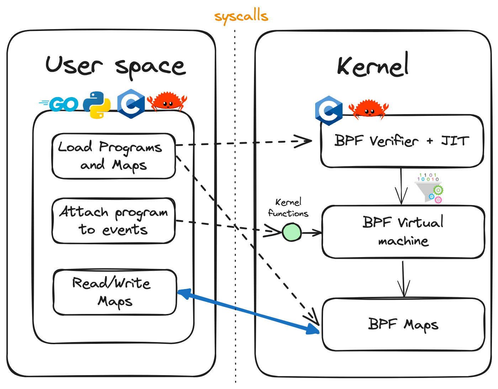
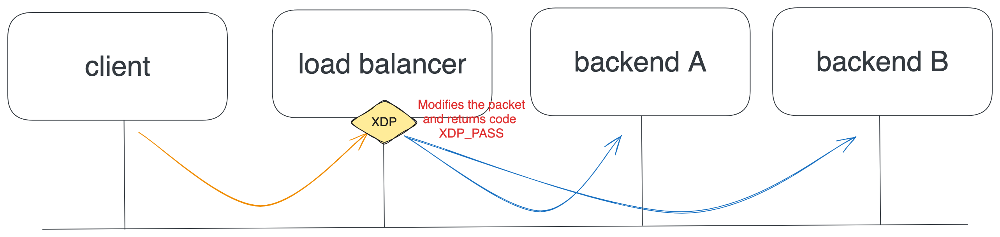
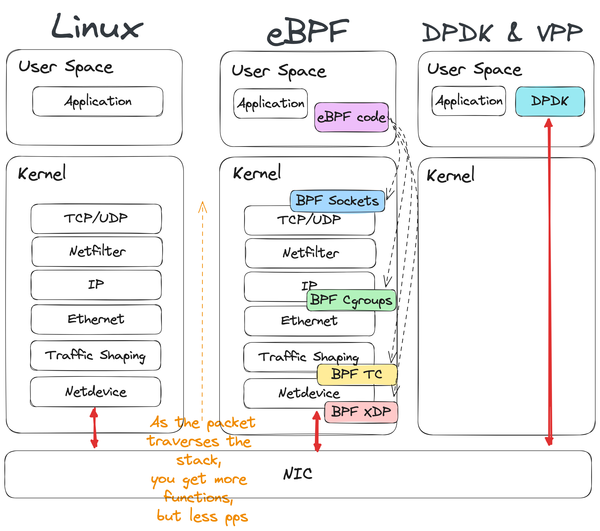
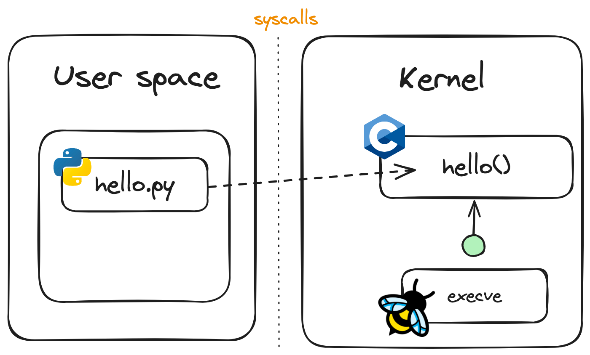
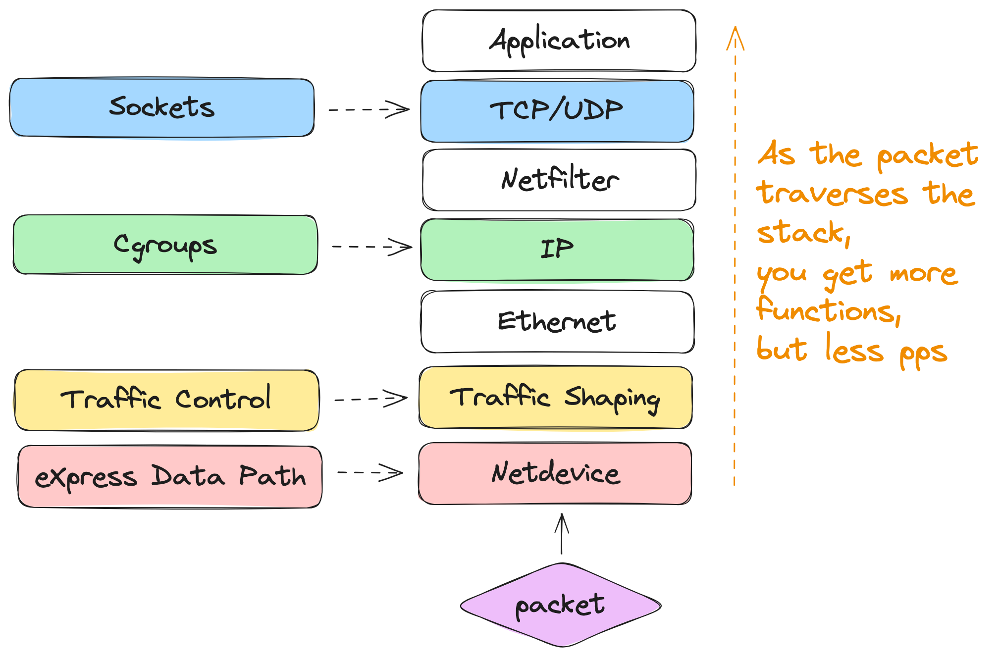

# eBPF 101

---

> eBPF does to Linux what JavaScript does to HTML

Brendan Gregg

---

# Agenda

- What is eBPF?
- Why do we need eBPF?
- Examples
  - The EASY way
  - The HARD way
- Takeaways


---

# What is eBPF?

- BPF, **Berkeley Packet Filter**, was introduced to Linux in 1997, kernel version 2.1.75
- It has been used in the tcpdump utility to capture packets
- In 2012 `seccomp-bpf` was added to kernel version 3.5, allowed to take decisions about user apps making system calls
- eBPF, **extended BPF**, started in 2014 with new features...

---

## The eBPF basics



<!-- ---

## eBPF, in 2014

- eBPF **maps** were introduced as data structures that can be accessed by BFP programs and from the user space
- `bpf()` system call allowed user space programs to interact with eBPF programs in the kernel
- BPF helper function were added
- The eBPF **verifier** ensures that eBPF programs are safe to run.
- Ability to attach eBPF programs kernel hooks (`kprobes`) -->

<!-- ---

## eBPF timeline

- 2016 Netflix adopts eBPF for system tracing
- 2016 Cillium project was announced
- 2017 Facebook made Katran
- 2018 eBPF became a separate subsystem within the Linux Kernel
- 2020 LSM (Linux Security Module) allows eBPF programs to be attached -->

---

## Why do we need eBPF?

- To add new functionalities to the Kernel without the overhead of creating Kernel Modules, and with **dynamic loading**
- **Better performance** skipping the cost of transitioning between kernel and user space (for each event)
- It's a great match for **cloud native** environments, no more need for sidecar pattern

---

# Where to use eBPF?

**Observability, Networking & Security**

- App observability (Beyla, Tetragon)
- Profile & Tracing (bpftrace, sysdig)
- Load-balancing (Katran)
- Network monitoring (Netobserv, pwru)
- Kubernetes (Cilium, Calico)
- Firewalls (Bpfilter)
- DDoS mitigation (Cloudflare, Meta)

Tools available: https://ebpf.io/applications/

---

## A Load Balancer from scratch



https://www.youtube.com/watch?v=L3_AOFSNKK8

---

## eBPF in Kubernetes


https://cilium.io/blog/2021/05/11/cni-benchmark/

---

## Comparing Linux, VPP, and eBPF

---



<!-- ---

### DPDK and VPP

- Networking stack is no longer handled by the kernel
- DPDK is the user space NIC driver, no longer visible to the kernel
- Fast for sending and receiving packets! but you need to do everything by yourself, i.e. sockets, packet processing, etc.
- FD.io is an open source software dataplane developed by Cisco. At the heart of FD.io, it is Vector Packet Processing (VPP)
- The ecosystem has grown with several [use cases](https://fd.io/usecases/), and adopters. -->

---

<style scoped>
table {
    height: 100%;
    width: 100%;
    font-size: 22px;
}
</style>

### Some numbers

| Linux                                                    | DPDK & VPP                                                                                    | XDP and eBPF                                                                                                      |
| -------------------------------------------------------- | --------------------------------------------------------------------------------------------- | ----------------------------------------------------------------------------------------------------------------- |
| **~30 cores** for 28Mpps forwarding                      | **~3 cores** for 28Mpps forwarding                                                            | **~5 cores** for 28Mpps forwarding                                                                                |
| Rich feature set. Socket programming as usual (IPtables) | Amazing performance!, but you lose the NIC from the Kernel and need to reimplement everything | Excellent performance with early packet processing and fallback to Kernel. Access to FIB table (`bpf_fib_lookup`) |
| Optimized for general purpose                            | Great for forwarding plane, with networking features                                          | Optimized for best of both worlds                                                                                 |

<sub><sub><sub>
https://virtualnog.net/posts/2020-12-11-linux-networking/
</sub></sub></sub>

---

### Both can cooperate


https://www.6wind.com/6windgate-5-0-versus-vpp-fast-path-benefits-from-linux-integration-and-ebpf/

---

# Examples

Check the main [README.md](./README.md) for details to setup the environment and run the examples

---

# The EASY way

The BCC library, BPF Compiler Collection (BCC)

> BCC is a toolkit for creating efficient kernel tracing and manipulation programs with eBPF, and includes several useful tools and examples.

- kernel instrumentation in C (and includes a C wrapper around LLVM)
- front-ends in Python and lua
- takes care of a lot of low-level details

There are frameworks for other languages (`ebpf-go`)

---

## Hello World



Code available at https://github.com/chadell/ebpf-playground/blob/main/examples/python/hello.py

---

### Hello World - code

```py
from bcc import BPF
program = r"""
int hello(void *ctx) {
    bpf_trace_printk("Hello NetBCN!");
    return 0;
}
"""
# Loads the C code from a string
b = BPF(text=program)
# Retrieves the syscall for execve
syscall = b.get_syscall_fnname("execve")
# Attaches the C function hello to the event
b.attach_kprobe(event=syscall, fn_name="hello")
# Outputs the trace in the screen
b.trace_print()
```

---

## The ping example



Code available at https://github.com/chadell/ebpf-playground/blob/main/examples/python/ping.py

---

## The ping example code

```py
from bcc import BPF
program = r"""
#include "network.h"
#include <bcc/proto.h>
#include <linux/pkt_cls.h>
int xdp(struct xdp_md *ctx) {
  void *data = (void *)(long)ctx->data;
  void *data_end = (void *)(long)ctx->data_end;
  if (is_icmp_ping_request(data, data_end)) {
        bpf_trace_printk("Got an ICMP packet");
        return XDP_PASS;
  }
  return XDP_PASS;
}
"""
b = BPF(text=program)
fx = b.load_func("xdp", BPF.XDP)
BPF.attach_xdp("lo", fx, 0)
b.trace_print()
```

---

# The HARD way

Let's use C code without helpers:

- Use the `bpftool`
- Compile the C program
- Load the eBPF code
- Attach to the loopback XDP hook

Code available at https://github.com/chadell/ebpf-playground/blob/main/examples/c/hello.bpf.c

---

## C BPF code

```c
#include <linux/bpf.h>
#include <bpf/bpf_helpers.h>
// This global variable it's converted to a MAP
int counter = 0;
// SEC() is a macro that defines the type of eBPF program
SEC("xdp")
int hello(struct xdp_md *ctx) {
    // bpf_printk is a helper function by libbpf
    bpf_printk("Packet received %d", counter);
    counter++;
    // XDP functions return the action for the packet
    return XDP_PASS;
}
// The eBPF verifier inspects the license of eBPF programs
char LICENSE[] SEC("license") = "Dual BSD/GPL";
```

---

## C BPF step by step

- Install `lipbpf`
- Compile the program (`-target bpf`)
- Check the compiled object
- Install `bpftool` to
  - Load the eBPF program and check it
  - Attach the eBPF program to an interface
  - Inspect the eBPF Maps
- See what's going on in the `trace_pipe`
- Detach and unload the eBPF program, with `bpftool`
- Let's make the Verifier unhappy

---

# Takeaways

- The Verifier can get complicated
- Some kernel familiarity is needed
- Even there are some helpers, there are some limitations
- Kernel support has to be assessed

<!-- loops were introduced in Linux 5.17 -->

---

<style scoped>
ul {
    height: 100%;
    width: 100%;
    font-size: 30px;
}
</style>

# Resources

- Book: [Learning eBPF](https://github.com/lizrice/learning-ebpf), by Liz Rice
- https://ebpf.io/labs/
- https://gist.github.com/satrobit/17eb0ddd4e122425d96f60f45def9627
- https://speakerdeck.com/fedepaol/ebpf-for-the-rest-of-us-golab-2023

---

# Thanks!

Contact via Linkedin [@christianadell](https://www.linkedin.com/in/christianadell/)
